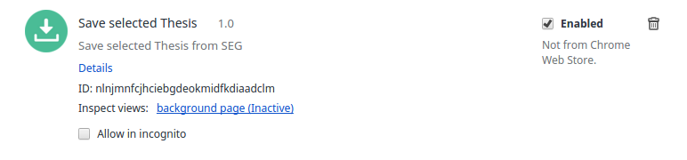
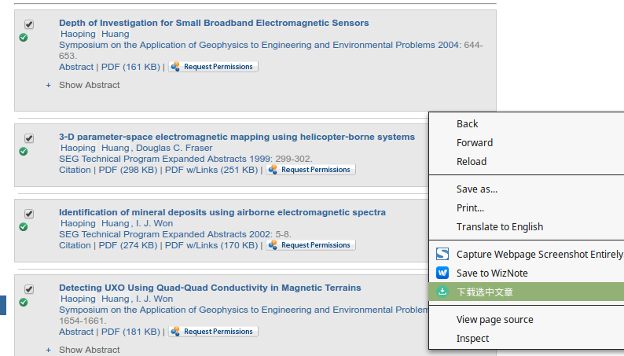
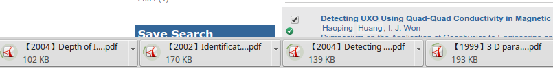

save selected thesis from SEG
===

1、功能
-----
使用这个chrome插件，可以批量下载SEG上面的文章，并将下载的文章以“【年份】标题”的形式命名。

2、背景
------

在地球物理领域，最著名的数据库就是SEG了，所以在对某一具体领域调研时，经常需要在SEG上查找相关文献，这些文献少则几十篇，多则一两百篇。 

这样就出现了2个问题：
        
    1、每篇文章下载都需要在搜索结果页面中点击pdf链接，在弹出的新标签页中保存pdf文件。
    2、下载的pdf文件文件名很乱，有些直接是doi号，不易之后查找。
        
所以就写了这么一个chrome插件，顺便学习了一下javascript。

3、安装及使用
------
将save_selected_thesis_for_SEG.crx拖到chrome的扩展程序页，就会提示安装。 
可以参考安装chrome插件的教程：[chrome如何安装第三方插件？](http://jingyan.baidu.com/article/c1465413596be80bfcfc4cfa.html) 
安装完成后扩展程序页面会显示新增的插件。
 
然后就可以正常使用了。 
在[SEG](http://library.seg.org)搜索关键字，在搜索页中选中你需要下载的文章（前提是你有下载权限），然后在这个页面任意处单机右键，在出现的菜单中选择"下载选中文章"。如下图所示：
 
该插件就会自动寻找下载地址，保存到chrome默认的下载路径下。如下图所示：
 

4、说明
------
本插件为个人学习所用，不做任何商业用途，若您感觉有任何侵权行为或这插件上的使用问题，欢迎联系我<E-mail:shawpan@yeah.net>